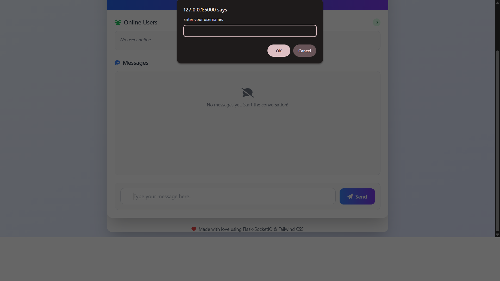
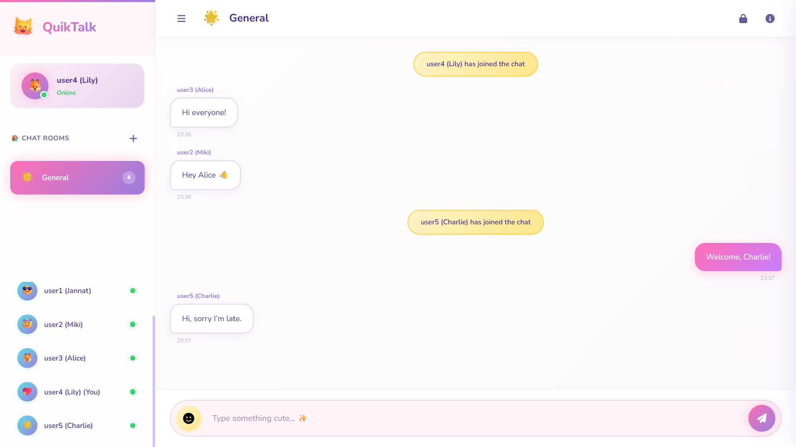
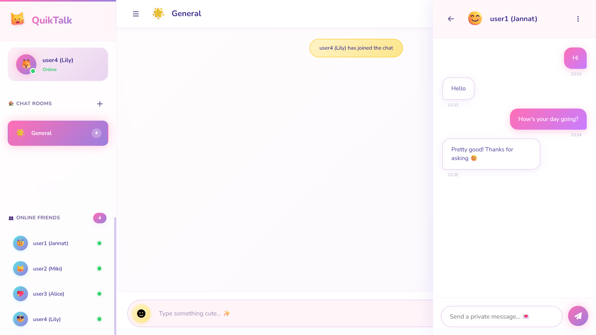

# 💬 QuikTalk - Real-Time Chat Application

<div align="center">


A modern real-time chat application built with Flask-SocketIO featuring message encryption, multiple chat rooms, private messaging, and a beautiful pastel UI design.

[](https://python.org)
[](https://flask.palletsprojects.com)
[](https://socket.io)

</div>

---

## 📑 Table of Contents

-   [Features](#-features)
-   [Project Structure](#-project-structure)
-   [Getting Started](#-getting-started)
-   [Technologies Used](#️-technologies-used)
-   [Usage Guide](#-usage-guide)
-   [Configuration](#️-configuration)
-   [Requirements](#-requirements)
-   [Socket Events](#-socket-events)
-   [Screenshots](#-screenshots)
-   [Message Scheduling Algorithms](#-message-scheduling-algorithms)
-   [Contributing](#-contributing)
-   [Troubleshooting](#-troubleshooting)
-   [Future Enhancements](#-future-enhancements)

---

## ✨ Features

### 🎨 Beautiful UI

-   **Pastel Color Palette** - Bubblegum Pink, Lilac, and Aqua theme
-   **Glassmorphism Effects** - Modern frosted glass design
-   **Emoji Avatars** - Fun animal emojis for each user
-   **Smooth Animations** - Bouncing logos, floating decorations, slide-in messages
-   **Responsive Design** - Works on desktop and mobile

### 💬 Chat Features

-   **Real-time Messaging** - Instant message delivery using WebSockets
-   **Multiple Chat Rooms** - Create, join, and manage different rooms
-   **Private Messaging** - Send direct encrypted messages to users
-   **Message History** - Room-specific message history
-   **Emoji Picker** - Quick access to emojis

### 🔐 Security

-   **End-to-End Encryption** - Fernet symmetric encryption for messages
-   **Room-Specific Keys** - Each room can have its own encryption key
-   **Secure Configuration** - Environment-based secret management

### 📊 Advanced Features

-   **Comprehensive Logging** - Categorized logs with file rotation
-   **Message Scheduling Algorithms** - FCFS, FIFO, LRU, Round Robin, Priority
-   **User Status Tracking** - Online status indicators
-   **System Notifications** - Join/leave notifications

---

## 📁 Project Structure

```
chat-app/
├── app.py              # Main Flask application
├── config.py           # Configuration settings
├── requirements.txt    # Python dependencies
├── services/           # Encryption, logging, room management
├── handlers/           # Message, room, user, DM handlers
├── templates/          # HTML templates
├── static/             # CSS, JS, images
└── logs/               # Log files (gitignored)
```

---

## 🚀 Getting Started

### Prerequisites

-   Python 3.8 or higher
-   pip (Python package manager)

### Installation

1. **📥 Clone the repository**

    ```bash
    git clone https://github.com/miftah1299/chat-app.git
    cd chat-app
    ```

2. **🐍 Create virtual environment**

    ```bash
    python -m venv venv

    # On Windows (Git Bash)
    source venv/Scripts/activate

    # On Windows (CMD)
    venv\Scripts\activate

    # On macOS/Linux
    source venv/bin/activate
    ```

3. **📦 Install dependencies**

    ```bash
    pip install -r requirements.txt
    ```

4. **▶️ Run the application**

    ```bash
    python app.py
    ```

5. **🌐 Open your browser**
    ```
    http://127.0.0.1:5000
    ```

---

## 🛠️ Technologies Used

### Backend

| Technology         | Purpose                           |
| ------------------ | --------------------------------- |
| **Flask**          | Web framework                     |
| **Flask-SocketIO** | Real-time WebSocket communication |
| **Cryptography**   | Message encryption (Fernet)       |
| **Eventlet**       | Async networking                  |
| **Python Logging** | Comprehensive logging system      |

### Frontend

| Technology           | Purpose                                |
| -------------------- | -------------------------------------- |
| **HTML5**            | Structure                              |
| **CSS3**             | Custom cute styling with CSS variables |
| **JavaScript**       | Client-side functionality              |
| **Socket.IO Client** | WebSocket connection                   |
| **Google Fonts**     | Nunito font family                     |
| **Font Awesome**     | Icons                                  |

---

## 📖 Usage Guide

### 💬 Joining the Chat

1. Enter your nickname in the welcome modal
2. Click "Join Chat 🎉"
3. You'll be automatically added to the General room

### 🏠 Chat Rooms

-   **View Rooms**: See available rooms in the sidebar
-   **Join Room**: Click on any room to join
-   **Create Room**: Click the ➕ button to create a new room
-   **Private Rooms**: Check "Make this room private" when creating

### 💌 Private Messages

-   Click on any user in "Online Friends" to open a DM
-   Messages are automatically encrypted
-   Close the DM panel with the back arrow

### 🔐 Encryption

-   Toggle encryption with the 🔒 button in the header
-   When enabled, messages are encrypted before sending
-   Encrypted messages show a 🔐 badge

### 😊 Emojis

-   Click the 😊 button to open the emoji picker
-   Select any emoji to add it to your message

---

## ⚙️ Configuration

Configuration is managed through `config.py`:

```python
# Server settings
HOST = '127.0.0.1'
PORT = 5000

# Encryption
ENCRYPTION_KEY = 'your-secret-key'

# Logging
LOG_LEVEL = 'INFO'  # DEBUG, INFO, WARNING, ERROR
LOG_DIR = 'logs'

# Chat settings
MAX_MESSAGE_LENGTH = 1000
DEFAULT_ROOM = 'General'
MESSAGE_HISTORY_LIMIT = 100
```

### Environment Variables

Create a `.env` file for sensitive configuration:

```env
SECRET_KEY=your-super-secret-key
FLASK_ENV=development
```

---

## 📋 Requirements

```
Flask==2.3.3
Flask-SocketIO==5.3.6
Werkzeug==2.3.7
eventlet==0.33.3
gunicorn==21.2.0
cryptography==41.0.0
python-dotenv==1.0.0
```

---

## 🔌 Socket Events

| Event              | Type          | Description          |
| ------------------ | ------------- | -------------------- |
| `set_username`     | Client→Server | Set user's nickname  |
| `message`          | Client→Server | Send a chat message  |
| `create_room`      | Client→Server | Create a new room    |
| `join_room`        | Client→Server | Join a room          |
| `private_message`  | Both          | Send/receive DM      |
| `receive_message`  | Server→Client | New message received |
| `update_user_list` | Server→Client | Online users list    |

---

## 📸 Screenshots

### Login Screen



### Chat Interface



### Private Messaging



---

## 🧠 Message Scheduling Algorithms

The application demonstrates various message processing algorithms:

| Algorithm       | Description                                                  |
| --------------- | ------------------------------------------------------------ |
| **FCFS**        | First Come First Serve - processes messages in arrival order |
| **FIFO**        | First In First Out - sequential processing                   |
| **LRU**         | Least Recently Used - prioritizes older messages             |
| **Round Robin** | Time-slice based processing                                  |
| **Priority**    | Processes based on message priority levels                   |

---

## 🤝 Contributing

1. Fork the repository
2. Create a feature branch (`git checkout -b feature/amazing-feature`)
3. Commit your changes (`git commit -m 'Add amazing feature'`)
4. Push to the branch (`git push origin feature/amazing-feature`)
5. Open a Pull Request

---

## 🐛 Troubleshooting

| Issue               | Solution                              |
| ------------------- | ------------------------------------- |
| Port already in use | Change port in `config.py`            |
| Dependencies error  | Run `pip install -r requirements.txt` |
| Virtual env issues  | Delete `venv/` and recreate           |
| CSS not updating    | Hard refresh with `Ctrl+Shift+R`      |
| Encryption error    | Ensure `cryptography` is installed    |

---

## 🎯 Future Enhancements

-   File sharing capabilities
-   Dark/Light theme toggle
-   User authentication with database
-   Message search functionality
-   Voice/Video chat
-   Message reactions
-   User profiles with avatars

---

<div align="center">

**Made with 💖 using Flask-SocketIO**

🌟 **Star this repository if you found it helpful!** 🌟

</div>
