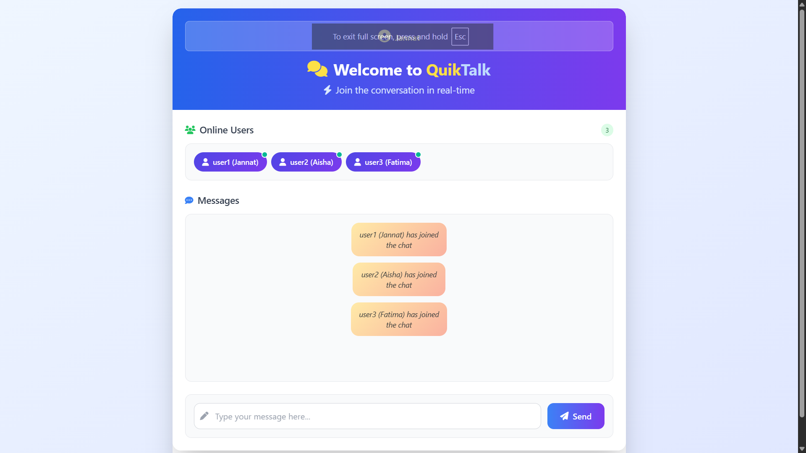
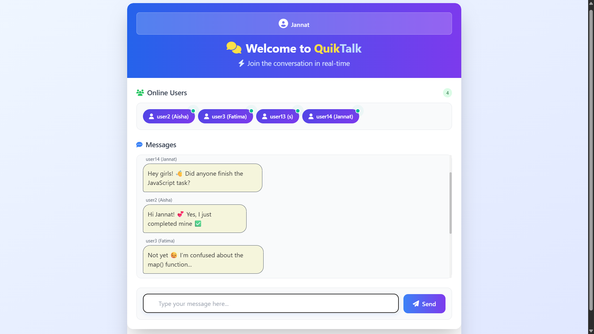

# 💬 QuikTalk - Real-Time Chat Application

A modern real-time chat application built with Flask-SocketIO featuring multiple message scheduling algorithms and a responsive UI.

## 📑 Table of Contents

-   [Features](#-features)
-   [Project Structure](#-project-structure)
-   [Getting Started](#-getting-started)
-   [Technologies Used](#️-technologies-used)
-   [Message Scheduling Algorithms](#-message-scheduling-algorithms)
-   [Usage Guide](#-usage-guide)
-   [Configuration](#️-configuration)
-   [Requirements](#-requirements)
-   [Key Features in Detail](#-key-features-in-detail)
-   [Contributing](#-contributing)
-   [Troubleshooting](#-troubleshooting)
-   [Screenshots](#-screenshots)
-   [Future Enhancements](#-future-enhancements)
-   [License](#-license)

## ✨ Features

-   **Real-time Communication**: Instant messaging using WebSockets
-   **Multiple Scheduling Algorithms**:
    -   First Come First Serve (FCFS)
    -   First In First Out (FIFO)
    -   Least Recently Used (LRU)
    -   Round Robin
    -   Priority Scheduling
-   **User Management**: Automatic user numbering (user1, user2, etc.)
-   **Responsive Design**: Modern UI with Tailwind CSS
-   **Message Alignment**: Sender messages on right, receiver messages on left
-   **User List**: Live display of connected users
-   **Visual Feedback**: Different styling for sent vs received messages
-   **User Profile Display**: Shows current logged-in user
-   **System Notifications**: Join/leave chat notifications
-   **Username Validation**: Ensures users enter a valid username

## 📁 Project Structure

```
chat-app/
├── app.py                 # Main Flask application with SocketIO
├── requirements.txt       # Python dependencies
├── tailwind.config.js     # Tailwind CSS configuration
├── templates/
│   └── index.html        # Main chat interface
├── ystatic/
│   ├── css/
│   │   └── style.css        # Custom styles
│   ├── js/
│   │   └── chat.js          # Client-side JavaScript
│   └── images/
│       ├── chat-animation.gif
│       └── chat-logo.png
└── README.md
```

## 🚀 Getting Started

1. **📥 Clone the repository**:

    ```bash
    git clone https://github.com/miftah1299/chat-app.git
    cd chat-app
    ```

2. **🐍 Create a virtual environment and install dependencies**:

    ```bash
    python -m venv venv

    # On Windows
    venv\Scripts\activate

    # On macOS/Linux
    source venv/bin/activate

    pip install -r requirements.txt
    ```

3. **▶️ Run the Flask application**:

    ```bash
    python app.py
    ```

4. **🌐 Open your browser and navigate to**:

    ```
    http://127.0.0.1:5000
    ```

5. **💬 Start chatting**:
    - 👤 Enter your username when prompted
    - ⌨️ Type messages and see them appear in real-time
    - 🔄 Open multiple browser tabs to simulate multiple users

## 🛠️ Technologies Used

### Backend:

-   **Flask** - Web framework
-   **Flask-SocketIO** - Real-time communication
-   **Python collections** (deque, OrderedDict) - Message queuing
-   **Eventlet** - Asynchronous networking library
-   **Gunicorn** - WSGI HTTP Server

### Frontend:

-   **HTML5** - Structure
-   **Tailwind CSS** - Modern utility-first CSS framework
-   **JavaScript** - Client-side functionality
-   **Socket.IO** - WebSocket client library

## 🧠 Message Scheduling Algorithms

The application demonstrates various message processing algorithms:

1. **FCFS (First Come First Serve)**:

    - Messages processed in the order they arrive
    - Simple queue-based implementation using `deque`

2. **FIFO (First In First Out)**:

    - Similar to FCFS, processes messages sequentially
    - Ensures fairness in message handling

3. **LRU (Least Recently Used)**:

    - Prioritizes least recently accessed messages
    - Uses `OrderedDict` for timestamp tracking

4. **Round Robin**:

    - Time-slice based message processing
    - Gives each message equal processing time

5. **Priority Scheduling**:
    - Messages processed based on priority levels
    - Higher priority messages handled first

## 📖 Usage Guide

1. **Connection**: When you connect, you'll be assigned a unique user ID (user1, user2, etc.)
2. **Profile**: Your username is displayed at the top of the chat interface
3. **Messaging**: Type messages in the input field and press "Send" or hit Enter
4. **Your Messages**: Appear on the right side with blue styling
5. **Others' Messages**: Appear on the left side with gray styling
6. **User List**: Shows all currently connected users in real-time
7. **Notifications**: System messages notify when users join or leave

## ⚙️ Configuration

-   **Port**: Default port is 5000 (configurable in app.py)
-   **Host**: Default host is 127.0.0.1 (configurable in app.py)
-   **CORS**: Enabled for all origins (configurable in app.py)
-   **Algorithm**: Change message processing algorithm in app.py

## 📋 Requirements

```
Flask==2.0.1
Flask-SocketIO==5.1.1
eventlet==0.38.2
gunicorn==23.0.0
```

## 🎯 Key Features in Detail

### 💬 Real-time Messaging

-   Instant message delivery using WebSocket technology
-   No page refresh required
-   Supports multiple concurrent users

### 🎨 Modern UI Design

-   Clean and intuitive interface
-   Responsive design works on all devices
-   Visual distinctions between sent and received messages
-   Smooth animations and transitions

### 👥 User Management

-   Automatic user identification and numbering
-   Real-time user list updates
-   Join/leave notifications

## 🤝 Contributing

1. Fork the repository
2. Create a feature branch (`git checkout -b feature/amazing-feature`)
3. Commit your changes (`git commit -m 'Add some amazing feature'`)
4. Push to the branch (`git push origin feature/amazing-feature`)
5. Open a Pull Request

## 🐛 Troubleshooting

### Common Issues:

-   **Port already in use**: Change the port in `app.py`
-   **Dependencies not installed**: Run `pip install -r requirements.txt`
-   **Virtual environment issues**: Recreate the virtual environment

## 📸 Screenshots

### Login Screen


### Dynamic User List



### Live Chat Conversation



## 🎯 Future Enhancements

-   File sharing capabilities
-   Dark/Light theme toggle
-   User authentication and login
-   Message history storage
-   Message search functionality

## 📄 License

This project is open source and available under the MIT License.

---

**Made with ❤️ using Flask-SocketIO and Tailwind CSS**

### 🌟 Star this repository if you found it helpful!
